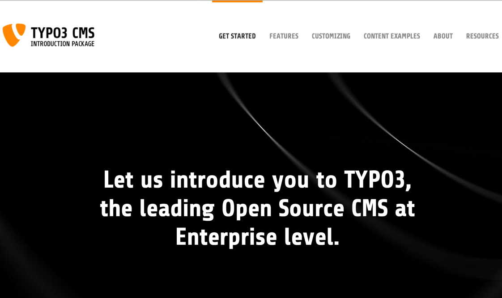

.. include:: ../Includes.txt

.. _introduction:

============
Introduction
============

.. _what-it-does:

What does it do?
================

This extension can be used to embed news-articles in individual layouts.
Each area of the layout can consist of unique content that is only related to one news-article - or
more general things like recurring info, banners or any other kind of content can be integrated.

This extension extends the extension news (tx_news) by only two fields but by powerful options.
The new approach is that the news-article might be surrounded by the layout-areas and the content can
still be saved as related to any distinct article. The layout for every article can be choosen out of 
predefined layouts, the different layout-areas can be filled with any kind of content-elements. Like
this the news can be enriched with tables, diagrams, or whatever is desired or required.

The current basic set of layouts has just areas like top, bottem, left and right in different variations.
The extension makes it possible to create more layouts which could be also more semantic, like 'report',
'news-article', 'knowwledge-base', 'wiki-article', etc.. As example on wikipedia all countries have
a sidebar in table-design with map, flag and important data. With this extension it's possible to provide
those sub-templates which can be chosen per article, like this several articles can also have different
layouts and different kinds of additional content.

The concept is primary to provide functional areas to enrich articles or to enable a finer grained
separation of details in a functional kind. Therfore the choice of layout is directly saved in
the news-articles and has to be seen independent from the view - the kind how everything is displayed.
Nevertheless it's naturally possible to use this extension primary for optical reasons.

.. important::

   Don't forget to repeat your extension's version number in the
   :file:`Settings.cfg` file, in the :code:`release` property. It will be
   automatically picked up on the cover page by the :code:`|release|`
   substitution.

.. _screenshots:

Screenshots
===========

First you can find some screenshots from the frontend, below then about the options in the backend.

@TODO

   Introduction Package just after installation (caption of the image)

How the Frontend of the Introduction Package looks like just after installation (legend of the image)